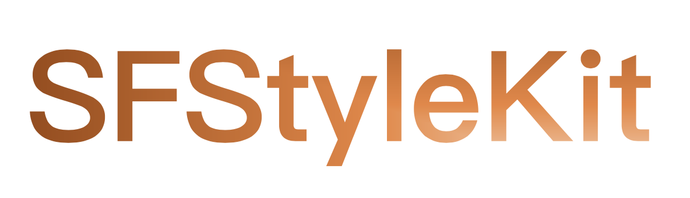

<div align="center" >
  
</div>

# SFStyleKit

[](https://travis-ci.org/Sfh03031/SFStyleKit)
[](https://cocoapods.org/pods/SFStyleKit)
[](https://cocoapods.org/pods/SFStyleKit)
[](https://cocoapods.org/pods/SFStyleKit)

## Introduction

SFStyleKit is a swift library that supports chain programming, so you don't need to write property name and equal operator many times anymore.
At present, it supports 22 types of chain programming methods such as UIKit and CALayer, and provides various extensions for UIDevice,
UIApplication, UIView, UIImage, UIImageView, UIButton, UIColor, etc. such as UIDevice's device model, system version, battery, screen
orientation, screen brightness, device volume, jailbreak status, total/available disk size and other properties or methods; UIApplication's
cache path and memory usage; UIView's click events and animations; UIImage's loading of gif data and saving to system albums; UIImageView's
preview and loading of gif images; UIButton's adjustment the relative position of images and text; UIColor's random colors, Chinese colors,
Pantone's annual colors...and so on.

(zh: SFStyleKit是一个支持链式编程写法的swift库，使用它就不需要写很多的属性名和等于号了。目前，它支持UIKit和CALayer共22种类型的链式编程写法，同时为UIDevice、UIApplication、UIView、UIImage、UIImageView、UIButton、UIColor等提供了各式扩展。例如UIDevice的设备型号、系统版本、电池、屏幕方向、屏幕亮度、设备音量、是否越狱、磁盘总/可用大小等属性或方法；UIApplication的缓存路径、内存使用情况；UIView的点击事件、动画；UIImage的加载gif数据、保存到系统相册；UIImageView的预览、加载gif图片；UIButton的调整图片和文字相对位置；UIColor的随机色、中国色、潘通年度色...等等。)


Like this:

```swift
        let backView = UIView()
        backView.sf
        // 位置和尺寸
            .frame(CGRect(x: 10, y: 50, width: self.view.bounds.width - 20, height: self.view.bounds.height / 2 - 50))
        // 背景色
            .backgroundColor(.random)
        // 设置边框
            .makeBorder(color: .brown, with: 1.0)
        // 设置圆角
            .makeCornerRadius(corners: [.topLeft, .topRight], radius: 10.0)
        // 设置阴影
            .makeShadow(5, color: .hex_bbcdc5, offset: CGSize(width: 5, height: 10), opacity: 1)
        // 右上角显示小红点
            .showBadgePoint()
        // 点击事件回调
            .addTapAction { view in
                // 右上角不显示小红点
                view?.sf.hiddenBadgePoint()
            }
        // 添加子视图
            .add(subview: alphaLabel)
            .add(subview: broveLabel)
            .add(subview: btn)
        self.view.sf.backgroundColor(.white).add(subview: backView)
```
you can see the code in the Example Project.(zh: 可以在示例工程查看以上代码。)

SFStyleKit also provides many easy-to-use extensions that can be viewed based on the source code.

(zh: SFStyleKit也提供了许多易用的扩展，这些扩展的详细信息可在源码里查看。)


Like Colors:

```swift
    /// Chinese Colors(zh: 中国色彩)
    
    /// 丁香色
    class var hex_cca4e3: UIColor { sf.hexColor(hex: "#cca4e3") }
    /// 雪青
    class var hex_b0a4e3: UIColor { sf.hexColor(hex: "#b0a4e3") }
    /// 群青
    class var hex_4c8dae: UIColor { sf.hexColor(hex: "#4c8dae") }
    /// 紫棠
    class var hex_56004f: UIColor { sf.hexColor(hex: "#56004f") }

    .....
    
    /// PanTong Year Colors(zh: 潘通年度色)
    
    /// 2024 - 柔和桃
    class var hex_PT_FFBE98: UIColor { sf.hexColor(hex: "#FFBE98") }
    /// 2023 - 非凡洋红
    class var hex_PT_BE3455: UIColor { sf.hexColor(hex: "#BE3455") }
    /// 2022 - 长春花蓝
    class var hex_PT_6667AB: UIColor { sf.hexColor(hex: "#6667AB") }
    /// 2021 - 明亮黄
    class var hex_PT_F5DF4D: UIColor { sf.hexColor(hex: "#F5DF4D") }
    
    ....
    
```

Like get some current device's infomations(zh: 像获取一些当前设备信息):

```swift
    print("idfv: \(UIDevice.current.sf.idfv)")
    print("StringWithUUID: \(UIDevice.current.sf.StringWithUUID)")
    print("batteryLevel: \(UIDevice.current.sf.batteryLevel)")
    print("batteryState: \(UIDevice.current.sf.batteryState)")
    print("cpuCoreNum: \(UIDevice.current.sf.cpuCoreNum)")
    print("cpuType: \(UIDevice.current.sf.cpuType)")
    print("deviceName: \(UIDevice.current.sf.deviceName)")
    print("deviceType: \(UIDevice.current.sf.deviceType)")
    print("deviceVolume: \(UIDevice.current.sf.deviceVolume)")
    print("diskTotalSize: \(UIDevice.current.sf.diskTotalSize)")
    print("diskAvailableSize: \(UIDevice.current.sf.diskAvailableSize)")
    print("ipAddress: \(String(describing: UIDevice.current.sf.ipAddress))")
    print("isJailbreak: \(UIDevice.current.sf.isJailbreak)")
    print("isSimulator: \(UIDevice.current.sf.isSimulator)")
    print("localizedModel: \(UIDevice.current.sf.localizedModel)")
    print("model: \(UIDevice.current.sf.model)")
    print("name: \(UIDevice.current.sf.name)")
    print("pasteBoardValue: \(UIDevice.current.sf.pasteBoardValue)")
    print("screenBrightness: \(UIDevice.current.sf.screenBrightness)")
    print("screenSize: \(UIDevice.current.sf.screenResolution)")
    print("simProvider: \(UIDevice.current.sf.simProvider)")
    print("systemName: \(UIDevice.current.sf.systemName)")
    print("systemVersion: \(UIDevice.current.sf.systemVersion)")
    
    print("memoryUsage: \(UIApplication.shared.sf.memoryUsage)")
    
``` 

## Requirements

* iOS 12.0 or later
* Swift 5.9.2
* Xcode 15.1

## Installation
<!---->
<!--### Carthage-->
<!--```-->
<!--  github "Sfh03031/SFStyleKit"-->
<!--```-->

### CocoaPods
SFStyleKit is available through [CocoaPods](https://cocoapods.org). To install
it, simply add the following line to your Podfile:

```ruby
pod 'SFStyleKit'
```

## Usage

```swift
import SFStyleKit

class ViewController: UIViewController {

    override func viewDidLoad() {
        super.viewDidLoad()
        
        let backView = UIView()
        backView.sf
        // 位置和尺寸
            .frame(CGRect(x: 10, y: 50, width: self.view.bounds.width - 20, height: self.view.bounds.height / 2 - 50))
        // 背景色
            .backgroundColor(.random)
        // 设置边框
            .makeBorder(color: .brown, with: 1.0)
        // 设置圆角
            .makeCornerRadius(corners: [.topLeft, .topRight], radius: 10.0)
        // 设置阴影
            .makeShadow(5, color: .hex_bbcdc5, offset: CGSize(width: 5, height: 10), opacity: 1)
        // 右上角显示小红点
            .showBadgePoint()
        // 点击事件回调
            .addTapAction { view in
                // 右上角不显示小红点
                view?.sf.hiddenBadgePoint()
            }
        // 添加子视图
            .add(subview: alphaLabel)
            .add(subview: broveLabel)
            .add(subview: btn)
        self.view.sf.backgroundColor(.white).add(subview: backView)
    }
    
    lazy var alphaLabel: UILabel = {
        let label = UILabel.init(frame: CGRect(x: 150, y: 50, width: self.view.bounds.width - 300, height: 40),
                                 bgColor: .white,
                                 text: "Magpie Bridge 2",
                                 textColor: .red,
                                 aligment: .center,
                                 radius: 5)
        label.sf.addTapAction { [weak self] view in
            guard let self = self else { return }
            UIAlertController().sf.message("click alphaLabel").show(self).hidden(2)
        }
        return label
    }()
    
    lazy var broveLabel: UILabel = {
        let value = "After its launch on March 20th, the Magpie Bridge 2 relay satellite underwent intermediate corrections, near moon braking, and lunar orbit maneuvers, and entered a planned 24-hour elliptical mission orbit around the moon on April 2nd. On April 6th, the Magpie Bridge 2 relay satellite successfully completed communication testing with Chang'e-4, which is conducting exploration missions on the far side of the moon. From April 8th to 9th, communication tests were conducted between the Queqiao 2 relay satellite and the Chang'e-6 probe (in ground condition)."
        
        let label = UILabel()
        label.sf
            .frame(CGRect(x: 50, y: 100, width: self.view.bounds.width - 100, height: 60))
            .bgColor(UIColor.hex_PT_FFBE98)
            .text(value)
            .textColor(.white)
            .font(UIFont.systemFont(ofSize: 15, weight: .semibold))
            .alignment(.center)
            .lines(2)
            .makeCornerRadius(corners: [.topLeft, .bottomRight], radius: 20.0)
            .addTapAction { [weak self] view in
                guard let self = self else { return }
                UIAlertController.alertStyle(.alert).message("click broveLabel\n\(value)").show(self).hidden(2)
            }
        return label
    }()
    
    lazy var btn: UIButton = {
        let btn = UIButton(type: .custom)
        btn.sf.frame(CGRect(x: 50, y: 180, width: self.view.bounds.width - 100, height: 60))
            .imagePosition(title: "click me click me click me click me click me", image: UIImage(named: "img_block"), state: .normal, space: 15.0, position: .bottom)
            .backgroundColor(.hex_0c8918)
            .makeRadius(10.0)
            .addTapAction { [weak self] view in
            guard let self = self else { return }
            UIAlertController.alertStyle(.actionSheet).message("the btn has been clicked").show(self).hidden(2)
        }
        
        return btn
    }()

    override func didReceiveMemoryWarning() {
        super.didReceiveMemoryWarning()
        // Dispose of any resources that can be recreated.
    }

}
```
### Customized
You can also create your own methods.(zh: 你也可以创建你自己的方法。)

Like this:
```swift
extension UIView: SFExStyleProtocol {}

public extension SFExStyle where Base: UIView {
    @discardableResult 
    func methodA(_ radius: CGFloat) -> SFExStyle {
        base.layer.cornerRadius = radius
        base.layer.masksToBounds = radius > 0
        return self
    }
}
```
## Support

CLLocation
- CLLocationCoordinate2D
- CLPlacemark

Foundation
- Array
- Bundle
- CGFloat
- Date
- Dictionary
- Double
- Float
- Int
- String

QuartzCore
- CALayer

UIKit
- UIAlertController
- UIApplication
- UIButton
- UICollectionView
- UICollectionViewFlowLayout
- UIColor
- UIControl
- UIDevice
- UIImage
- UIImageView
- UILabel
- UINavigationController
- UIScrollView
- UISlider
- UIStackView
- UISwitch
- UITableView
- UITextField
- UITextView
- UIView
- UIViewController

## Change log

2024.07.11, 0.1.3
- 1.Fix bugs

    (zh:修复bug)

- 2.Add new extensions with UICollectionView and UITableView

    (zh:为UICollectionView和UITableView扩展新的注册方法)

2024.05.15, 0.1.2
- 1.Add new common color extensions

    (zh:增加新的常用色扩展)
    
- 2.Adjust the hierarchical structure of UIView extension and update several comments

    (zh:调整UIView扩展的层级结构，更新若干注释)

2024.04.15, 0.1.1
- Initial version

    (zh:初始版本)

## Warning
If the system native method has a return value or a property that is read-only, this extension is not suitable for use.

(zh: 如果系统原生方法有返回值或者属性是只读属性，则不适用这种链式写法的扩展。)
 
## Contributing
Please make an issue or pull request if you have any request.

Bug reports, Documentation, or tests, are always welcome as well.

## Author

Sfh03031, sfh894645252@163.com

## License

SFStyleKit is available under the MIT license. See the LICENSE file for more info.
